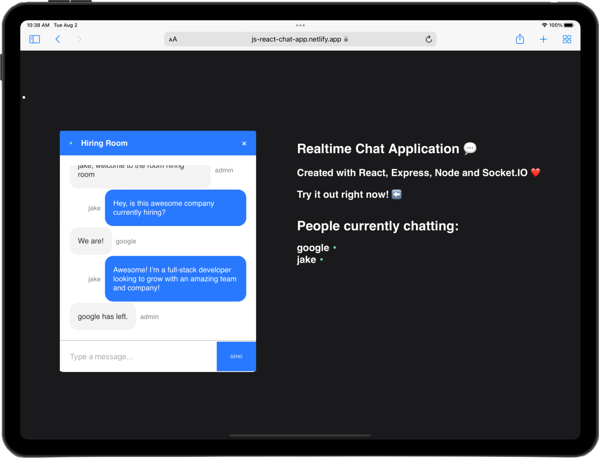

# React ChatRoom

## Overview:
Realtime chat application made with React! Uses socket.io for real-time data transfer. User is prompted to enter name and desired room and then is connected with other users of the same room.
## Technologies used:

- HTML
- CSS
- JavaScript
- React
- Node.js
- Express.js
- Socket.io

#### Built by www.jakeservin.dev
